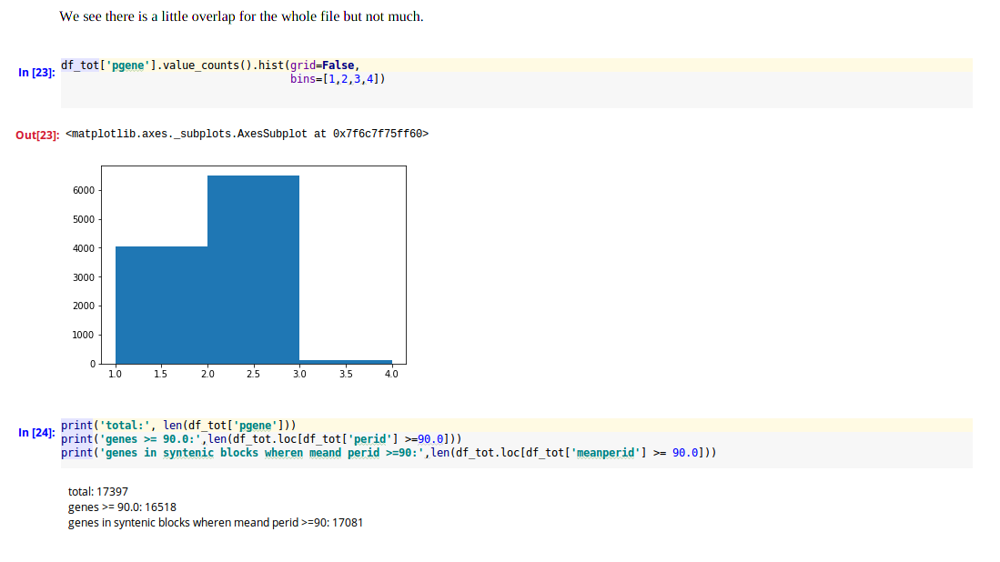

###Bag of Genes Approach
1. use stringent qac filtering.
2. take ks file and parse into gene calls.
3. It is possible to use either ks with percent id or just percent id.
4. When we call `strict_ks = True` vs `strict_ks = False`

```bash
ndh0004@IorekByrnison:~/code/coge_tools/test_out$ wc -l bog_sep18_qac*_abcalls.tsv 
 12796 bog_sep18_qac_abcalls.tsv
  3078 bog_sep18_qac_strict_abcalls.tsv
 15874 total

```

####Investigation of call files.
```bash
ndh0004@IorekByrnison:~/code/coge_tools/test_out$ awk '{print $2}' bog_sep18_qac_bag_of_genes.tsv | sort | uniq -c | awk '{print $1}' | sort | uniq -c | sort -n 
     25 4
     83 3
   4042 1
   6503 2

```
This suggests we should have 7,006 called anchors
based on number alone. But if we filter by percent id...
```bash
ndh0004@IorekByrnison:~/code/coge_tools/test_out$ awk '$10 >=90 {print $2}' bog_sep18_qac_bag_of_genes.tsv | sort |uniq -c |awk '{print $1}' |sort| uniq -c | sort -n 
     13 4
     42 3
   4107 1
   6398 2
ndh0004@IorekByrnison:~/code/coge_tools/test_out$ wc -l bog_sep18_qac_abcalls.tsv 
12796 bog_sep18_qac_abcalls.tsv
ndh0004@IorekByrnison:~/code/coge_tools/test_out$ echo $((6398 * 2 ))
12796
# again with ks_strict values we can reproduce the number of lines in ab_calls
ndh0004@IorekByrnison:~/code/coge_tools/test_out$ awk '$12 <=3.0 && $10 >=90  {print $2}' bog_sep18_qac_bag_of_genes.tsv | sort |uniq -c |awk '{print $1}' | sort | uniq -c | sort -n 
      6 4
     25 3
   1815 2
   4734 1
ndh0004@IorekByrnison:~/code/coge_tools/test_out$ echo $(( 1815 *2 ))
3630
#3 was not the ks_cutoff
ndh0004@IorekByrnison:~/code/coge_tools/test_out$ awk '$12 <=2.0 && $10 >=90  {print $2}' bog_sep18_qac_bag_of_genes.tsv | sort |uniq -c |awk '{print $1}' | sort | uniq -c | sort -n 
      5 4
     22 3
   1539 2
   4621 1
ndh0004@IorekByrnison:~/code/coge_tools/test_out$ echo $(( 1539 *2 ))
3078
#2 was set as cutoff...

```

```python
    pid_cutoff = 90.0
    ks_cutoff = 2
    syn_len_cutoff = 5
    strict_ks = False
    qac = True
```
The script is behaving as expected for making ab_calls. Notice that we did not filter by
syntenic length `syn_len_cutoff = 5` which is the minimum value reported by CoGe SynMap
If we had chose different lengths this would affect ouf final number of ab_calls.
As it stands now we are letting gene number and qac do the sorting for us. 


You may have also noticed that `qac = True`. a qac.ks file has different section delimiters 
than a normal gcoords.ks file. Setting `qac` to `True` deals with this problem.
 
We also have not lost any lines between qac.ks output and bag_of_genes.tsv 
```bash
ndh0004@IorekByrnison:~/code/coge_tools/test_out$ egrep -v '^#' ../data/51576_52024.CDS-CDS.last.tdd10.cs0.filtered.dag.all.go_D20_g10_A5.aligncoords.Dm0.ma1.qac2.1.50.gcoords.ks | wc -l 
17397
```
and this screen shot from Jupyter
 

I have now updated 
`parse_ks(infile,pid_cutoff,ks_cutoff,syn_len_cutoff,out_file,call=call,strict_ks=strict_ks, qac=qac)`
to include variable call. Call provides a default label in the 1st column
this will allow us to label multiple files for concatenation. At some 
point adding a seperate file column might be useful. But at this point, we will 
avoid doing that. 
Call update was successfull as suggested by the fact the number of calls don't
change just their labels.  The diffs of whole files change because the 
I changed parameters for calculating `meanks`. 


