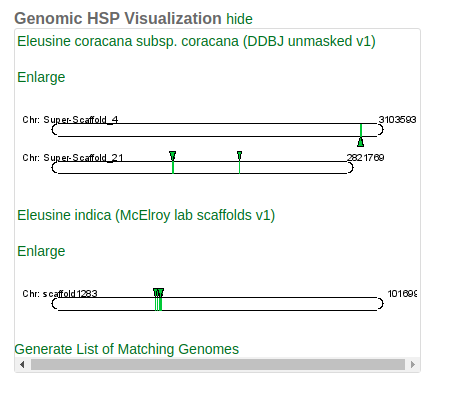
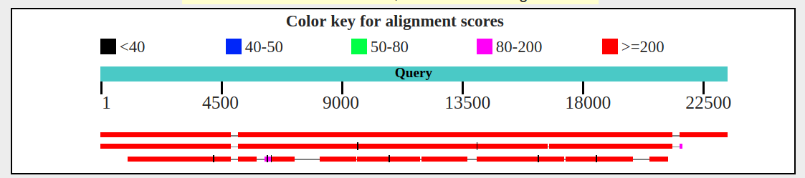

##Nuclear encoded cytoplasmic gene examination and ab_call.py validation.
1. gene WRKY from Sorghum. 
2. SynFind in CoGe 
	this shows 2 hits in indica and 2 hits in coracana. 
	if we look at recent results from ab_call.py We find that these are supported. 
	```
	[ndh0004@hopper-login](full_run_sept5)[09:44]: grep Super-Scaffold_146 *net
	scaffold2_1212421_1413476	Super-Scaffold_146_3029929_3222495
	scaffold220_84470_392027	Super-Scaffold_146_1950408_2263235
	scaffold467_17619_253548	Super-Scaffold_146_670357_838725

	[ndh0004@hopper-login](full_run_sept5)[09:45]: grep scaffold93_ *net
	scaffold220_84470_392027	scaffold93_size1230182_subseq_1:987274_obj_284856_502765
	scaffold566_58694_215670	scaffold93_size1230182_subseq_1:987274_obj_657112_817819

	[ndh0004@hopper-login](full_run_sept5)[09:45]: grep scaffold566 *net
	scaffold566_58694_215670	scaffold93_size1230182_subseq_1:987274_obj_657112_817819

	[ndh0004@hopper-login](full_run_sept5)[09:47]: grep scaffold93 gt4_ab_calls_
	gt4_ab_calls_chrom_calls_all.tsv    gt4_ab_calls_chrom_calls_good.tsv   gt4_ab_calls_region_calls.tsv       
	gt4_ab_calls_chrom_calls_ambig.tsv  gt4_ab_calls_chrom_calls_prov.tsv   

	[ndh0004@hopper-login](full_run_sept5)[09:47]: grep scaffold93 gt4_ab_calls_chrom_calls_all.tsv 
	B	strong	1	0	scaffold93_size1230182_subseq_1:987274_obj	4	15	0	0
	```
3. The second gene indica gene is a false hit. This was confirmed by looking at synteny and using ncbi blast to compare putative
syntenic stretches.

###example with pictures.

1. Begin by blasting target seqs agains *Eleusine indica* transriptome on NCBI. 
2. Take *E.indica* accession to CoGe Blast.
3. Select regions features to compare in GeVO. 
4. Look at results. 

it appears we have a a good match.
5. Confirm with a blastn. This step is just additional confirmation. It in theory could be easily skipped. Sometimes it is nice to see it in a familiar format. We do this by selecting **all sequences** from the **Fasta files** column, and putting them through blast.  Additionally this tells us something about the *E. indica* assembly.The order of contigs is as follows top == *E. indica*, middle == Super-Scaffold_4, bottom == Super-Scaffold_21. Just looking at the blast hits at this level we can already assign A to Super-Scaffold_4 and B to Super-Scaffold_21.
Namely, that it is a scaffold with 2 breaks. 
 

This observation supports ab_call.py output. If we look closely at this output. It suggests that the call was made independent of a direct linkage between 4 and 21. If it were based on a direct comparison both col 6 and 7 should be identical. 
```
bash
> egrep -w 'Super-Scaffold_21|Super-Scaffold_4' gt4_ab_calls_chrom_calls_all.tsv 
A	strong	1	0	Super-Scaffold_4	20	0	0	0
B	strong	1	0	Super-Scaffold_21	1	20	0	0
```
using grep we can figure out what the calls were based on by looking back at the network file. 

```
bash
> for X in $( egrep -w 'Super-Scaffold_21_.*|Super-Scaffold_4_.*' *net | \
awk '{print $1"\n"$2}' |sort | uniq ) ; \
do stem=$( echo $X |rev| cut -d"_" -f 3-|rev )\
;egrep -w ${stem}_.* *net \
; done | sort | uniq 

scaffold406_110687_279242	Super-Scaffold_4_1110697_1281779
scaffold406_57303_278466	Super-Scaffold_225_277017_449607
scaffold49_112960_263299	Super-Scaffold_4_343027_524604 # not linked here.
scaffold54_226208_513231	Super-Scaffold_21_390038_603185
scaffold54_226208_569765	Super-Scaffold_467_348483_659877
```
And it shows us 4 was compared to 24 and 21 was compared to 467.  Why wasn't 21 directly compared to 4? If we look back at the raw DAGChainer output we find that the genes were not above the cutoff. Yet we still called the contigs identity correctly. 

```
bash
egrep -B1 -w scaffold1283 \
51576_52024.CDS-CDS.last.tdd10.cs0.filtered.dag.all.go_D20_g10_A5.aligncoords.gcoords\
 | egrep '#'
#1	400.0	a51576_Super-Scaffold_21	b52024_scaffold1283	f	8
#2	400.0	a51576_Super-Scaffold_21	b52024_scaffold1283	f	8
#1	350.0	a51576_Super-Scaffold_4	b52024_scaffold1283	r	7
```


